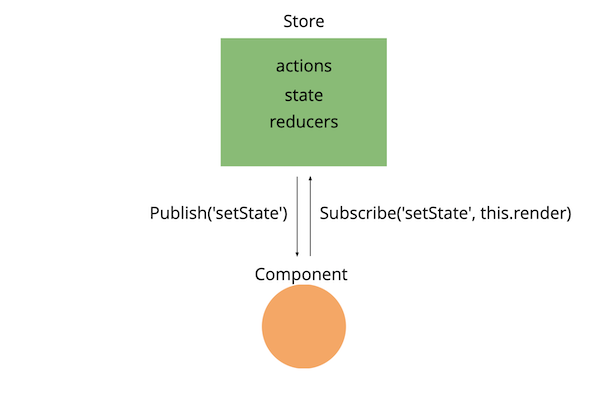

# PhotoViewer
- DEMO : https://limjungmok.github.io/PhotoViewer
- 클론 대상 : https://auto.naver.com/car/image.nhn?yearsId=127341

## How To Use

1. `npm install http-server -g` 
2. `http-server`
3. `http://127.0.0.1:8080/src/index.html`


## Structure
```bash
├── json/                     - Dummy Data
├── src/
│   ├── js/
│   │   ├── components/       - View 컴포넌트
│   │   ├── lib/              - 컴포넌트와 PubSub 인터페이스
│   │   ├── store/            - 전역 상태값을 제어할 Store 
│   │   ├── templates/        - View 컴포넌트에서 사용 할 문자열 템플릿
│   │   ├── utils/            - 유틸함수
│   │   └── app.js            - 메인 자바스크립트
│   │ 
│   ├── public/               
│   │   ├── css/              
│   │   └── images/           
│   └── index.html
└── README.md
```


## Structure/components
- `PhotoViewer.js`: 중앙 메인 이미지화면
- `PrevPhotoButton.js`: 메인 이미지 이전화면 이동 버튼
- `NextPhotoButton.js`: 메인 이미지 다음화면 이동 버튼
- `PhotoList.js`: 상단 소형 썸네일 리스트
- `PrevPaginiationButton.js`: 상단 소형 썸네일 페이지 이동 버튼
- `NextPaginationButton.js`: 상단 소형 썸네일 페이지 이동 버튼


## Structure/lib


- `pubsub.js`
  - Pub/Sub Pattern Interface. 
  - State-Reactive 형태의 디자인 패턴을 위한 선택

- `components.js`
  - 스토어 객체와 의존성을 가지는 컴포넌트 인터페이스
  - 스토어객체 전역상태값이 변경되면 `setState` 이벤트가 발생한다.
  - `setState` 이벤트 발생시, 컴포넌트의 `render` 함수를 호출한다.

## Structure/store
- `state.js`: 전역 상태값, PubSub 객체의 인스턴스
- `store.js`
  - Redux, Vuex 라이브러리의 Store 객체
  - 스토어 객체 내부에 PubSub 객체 생성
  - 상태변화를 요청하는 actions
  - 상태변화를 처리하는 reducers
  - 상태값을 Reactive 하게 관리하기 위해 Proxy 객체로 래핑한 state
- `actions.js`: 액션을 생성하여 모아둔다. 
- `reducers.js`: 상태를 변경할 함수


