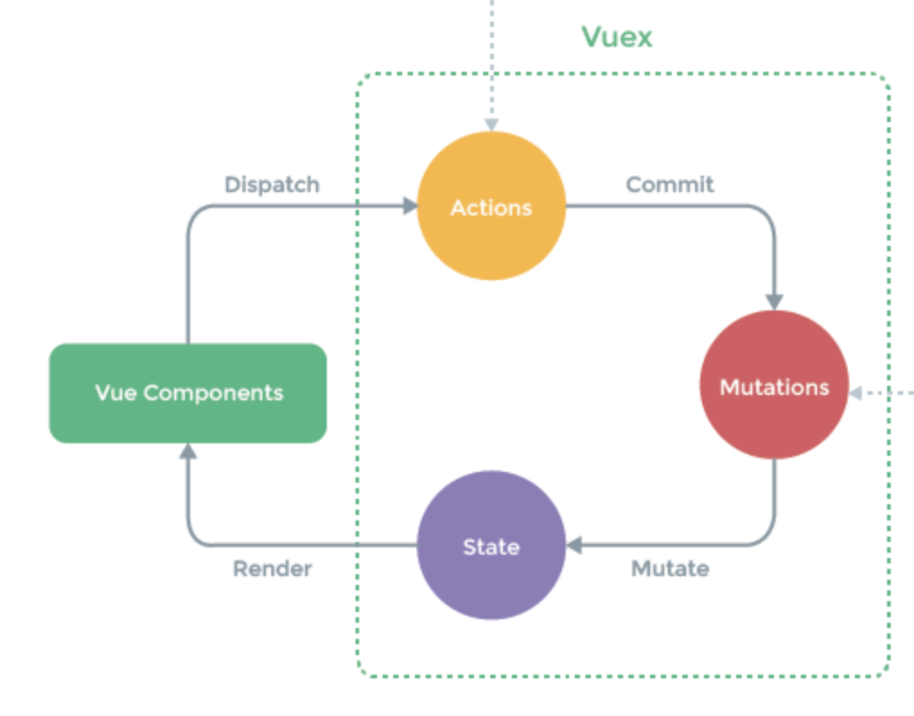

# PhotoViewer
https://auto.naver.com/car/image.nhn?yearsId=127341

1. 4개의 버튼과 이미지 슬라이더 및 이미지 뷰어 총 6개의 컴포넌트를 구성했습니다.
2. 이미지 처리의 경우 크게 2가지 처리방안을 생각했습니다.
  1. 이미지 src 만 갱신하고, 중복된 이미지 Request에 대해서는 브라우저 캐시에 의존하는 방법 
  2. 컴포넌트 내에서 캐싱객체를 설계하여, 중복된 이미지 Request를 없애는 방법(위의 사이트와 동일한방식)

처음 접근방식은 1번 접근방법을 선택하여 개발을 진행했고, 브라우저에 의존했을 때 캐시될 객체가 많을 경우 사이드이펙트가 발생했습니다.  
(처음부터 끝까지 반복하면 수백개 이상의 이미지 요청이 발생)  
2번 접근방법의 경우 캐싱객체를 만듬으로써 초기 비용이 크지만, 이미지 좌/우, 페이지 좌/우 이동시 한 번 호출한 이미지의경우 재호출이 발생하지않습니다.  

아래 실행방법 및 구조설계에 대한 의도를 작성해두었습니다. 

## 실행 방법
> Node 최신버전에서 실행부탁드립니다.(최소 > v8)

1. `npm install http-server -g` 
- `http-server` cli로 실행하면됩니다.
2. `http-server`
3. `localhost:8080/src` 또는 터미널에 실행중인 `PORT` 확인 후 접속


## 구조
- json
- src
  - js
  - public (css, images)
  - index.html

  
### json
```javascript
{
  "code":121449,
  "type":"all",
  "imageCount":73,
  "items": [
    {
      "index":1,
      "thumbURL":"https://imgauto-phinf.pstatic.net/20170919_172/auto_1505802094784hvqgh_JPEG/20170919152131_p5j9fjk4.jpg?type=f120_80",
      "viewURL":"https://imgauto-phinf.pstatic.net/20170919_172/auto_1505802094784hvqgh_JPEG/20170919152131_p5j9fjk4.jpg?type=f980_654",
      "originURL":"https://imgauto-phinf.pstatic.net/20170919_172/auto_1505802094784hvqgh_JPEG/20170919152131_p5j9fjk4.jpg",
      "imgDesc":""
    },
    ...
  ]
}
```

기존에 제공받은 데이터에서 사용하지 않는 프로퍼티를 제거하고, 정제된 데이터를 APP 에서 사용했습니다. (in `app.js`) 
1. `code`, `type`, `imageCount`, `item.index`, `item.imgDesc`, `item.originURL` -> 제거.  
2. `item.id` -> 난수 해시값을 이용해서 프로퍼티 추가 (실서비스 사용시 다른 유니크한 값 사용해야함.)

### js
- components
- lib
- store
- utils
- templates
- app.js


#### components
- 앱 내에서 사용되는 `컴포넌트.js`를 생성.  
- `PhotoList.js` 사진 목록을 렌더링하는 컴포넌트
- `PhotoViewer.js` 선택된 단일 사진을 렌더링하는 컴포넌트
- `PrevPaginateButton` 롤링되는 이전 사진목록 페이지를 호출하는 버튼
- `NextPaginateButton` 롤링되는 다음 사진목록 페이지를 호출하는 버튼
- `PrevPhotoButton` 이전 단일사진을 호출하는 버튼
- `NextPhotoButton` 다음 단일사진을 호출하는 버튼


#### lib
- `component.js` 
  - UI에 필요한 컴포넌트를 생성시 extends에 필요한 Behavior delegation(상속) 클래스 생성
  - UI 조작에 필요한 내부 메서드(_hide, _show, ....)
- `pubsub.js`
  - `Store` 이벤트 pub/sub을 위한 클래스
  - `subscribe` 함수를 통해, 이벤트 객체 내에 이벤트 배열을 만들고, 이벤트 이름과 콜백 핸들러를 받아 담아둔다.
  - `subscribe` 함수는 UI 컴포넌트가 생성될때 `setState` 이벤트를 subscribe 하고, `render()`함수를 핸들러로 설정한다.
  - `publish` 함수를 통해, 이벤트 객체 내의 이벤트 배열을 순회한다.
  - `publish` 함수는 state가 변경될때마다 `setState` 이벤트를 발행하며 `render()`함수를 실행한다.


#### store
- `action.js`
  - 상태를 변화(mutate)시키기 위해 `key`-`value`를 전달받고 commit 함수를 호출한다.
- `mutations.js`
  - 이전 `state`를 받아 `newState`를 반환하는 순수함수
- `state.js`
  - 리듀서의 `state` 같은 역할.
  - `limit`: 포토뷰어가 나열되는 리스트 갯수
  - `items`: 포토 객체를 담은 배열
  - `currentIndex`: `items`를 기준으로 한 현재 선택된 인덱스
- `store.js`
  - `Pubsub` 이용해서 `events` 바인딩.
  - `dispatch`, `commit`을 이용하여 `action`에 대한 상태변경을 처리함.
- `index.js`
  - `action`, `mutations`, `state`를 `Store` 객체에 인자로 담아서 `export`, 앱 내 유일객체로 UI 컴포넌트에서 상속해서 사용.  


#### utils
- 유틸함수로 나눈 기준은 다음과 같습니다.
- `state` 값을 인자로 받아 앱 전체에서 한번에 통용되고있는 함수(getCurrentPageIndex, getPrevPageIndex, getNextPageIndex, ...)
- 수식 연산을 위한 함수(getQuotient, getRemainder)
- 외부 라이브러리를 사용하지 못하기때문에 커스텀해서 사용하는 함수(deepCopy, fetch) 
- 함수 이름으로만 범용적으로 사용이 가능한 함수(getHashCode)

#### templates
- `` 태그를 위한 템플릿 파일.
- 마크업 변경에 용이하도록 두가지 타입으로 나누어 관리.
- 문자열 형태로 된 템플릿 파일을 위해 DOM Parser 유틸성 함수 내부에서만 사용.

#### app.js
- Store, Component, DATA를 이용해 앱을 구동시키는 메인 `js`.
- `Promise` 객체를 사용하여 SAMPLE_DATA 로딩 동기처리.
- DATA 정제 후 최초 `dispatch` -> setState publish -> render 함수 전체 1회 실행.


### 전체 흐름
해당 Application은 Vuex Flow를 참고해서 설계했습니다.


- App 실행시 app.js를 통해 `SAMPLE.json`을 `fetch`(실제로는 API 서버에 fetch 요청. 그냥 변수로 써도 되긴하지만 확장성을 고려해서 ajax Call).
- `Promise`를 이용해 동기적으로 데이터 호출 -> UI 렌더링 순서를 의도함.
- 데이터를 들고 오면, 필요없는 `property`를 제거하기위해 정제작업 실행.
- 정제 후 최초의 포토리스트 `state`를 갱신하기 위해 `dispatch` 실행. 
- UI 컴포넌트에서 `dispatch` 함수를 호출하면 `Store`는 해당하는 `action`을 호출합니다. 
- `action`은 전달받은 `key`+`value`를 `commit`하고, 
- `commit`함수는 내부에서 `key`에 맞는 `mutation` 함수를 호출합니다. (이때 `payload`에 `value`를 담아서 함수호출).
- `mutation` 함수는 순수 함수로서, 현재 `state`를 받아 `newState`를 반환하고, `state`를 갱신합니다.
- `state`는 `Proxy`객체의 `setter`로서 바인딩되어있기때문에, 값이 수정되면 `stateChange` `publish`를 하게되고,
- UI 컴포넌트는 상속하고있는 상위 `copmonent`의 `subscribe`를 통해 변경된 `state`를 기반으로 `render()`함수를 호출합니다.


